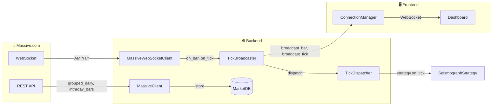

# Domain 1: Market Data Flow

> Massive.com API에서 실시간/히스토리 시장 데이터가 시스템으로 유입되는 경로

## 1. Module Participants

| Module | Location | Role |
|--------|----------|------|
| `MassiveClient` | `backend/data/massive_client.py` | REST API 클라이언트 (일봉, 분봉 조회) |
| `MassiveWebSocketClient` | `backend/data/massive_ws_client.py` | WebSocket 스트리밍 (AM: 1분봉, T: 틱) |
| `TickBroadcaster` | `backend/core/tick_broadcaster.py` | Massive WS → GUI WS 브릿지 |
| `TickDispatcher` | `backend/core/tick_dispatcher.py` | 틱 → 전략/모니터 배포 |
| `ConnectionManager` | `backend/api/websocket.py` | GUI WebSocket 관리 |
| `MarketDB` | `backend/data/market_db.py` | SQLite 영구 저장 |

## 2. Dataflow Diagram



## 3. Data Channels

| Channel | Source | Message Type | Frequency |
|---------|--------|--------------|-----------|
| `AM.*` | Massive WS | 1분봉 (OHLCV) | 1분 |
| `T.*` | Massive WS | 틱 (price, size) | 밀리초 단위 |
| REST `/grouped_daily` | Massive REST | 전체 일봉 | 1일 1회 배치 |
| REST `/aggregates` | Massive REST | 분봉/일봉 히스토리 | 온디맨드 |

## 4. Key Callbacks

```python
# MassiveWebSocketClient → TickBroadcaster
massive_ws.on_bar = tick_broadcaster._on_bar
massive_ws.on_tick = tick_broadcaster._on_tick

# TickBroadcaster → GUI (asyncio bridge)
asyncio.run_coroutine_threadsafe(
    ws_manager.broadcast_bar(...),
    loop
)
```

## 5. L2/L3 Caching Strategy

```
[Request] → L1 (In-Memory) → L2 (SQLite) → L3 (Massive API)
                 ↑                ↑              ↓
              hit: 0ms        hit: 10ms     fetch: 200ms+
```

- **L1**: 현재 세션 캐시 (RealtimeScanner.watchlist)
- **L2**: SQLite `daily_bars`, `intraday_bars` 테이블
- **L3**: Massive REST API (Rate Limited: 100 req/min)
