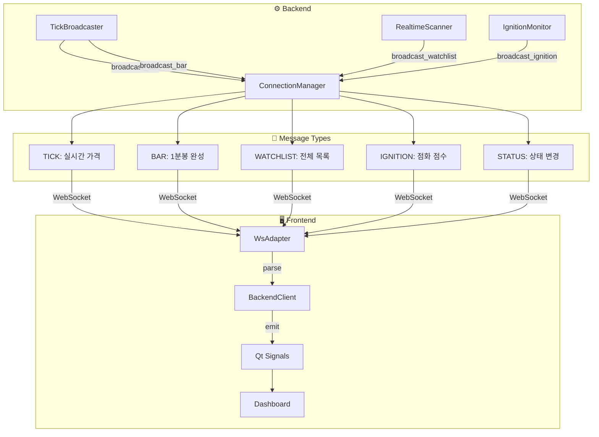
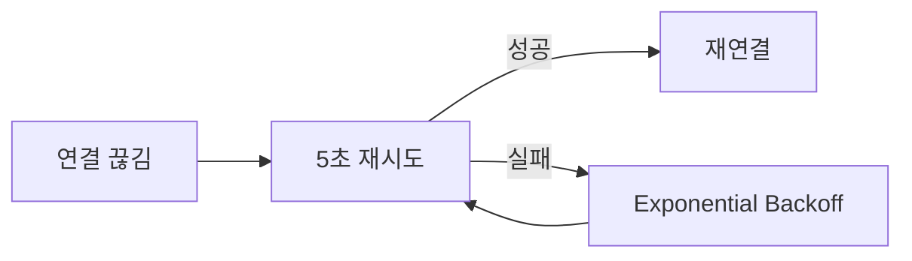

# Domain 4: Realtime Sync Flow

> Backend에서 Frontend로의 실시간 데이터 동기화 경로

## 1. Module Participants

| Module | Location | Role |
|--------|----------|------|
| `ConnectionManager` | `backend/api/websocket.py` | WebSocket 연결 관리 |
| `TickBroadcaster` | `backend/core/tick_broadcaster.py` | 틱/바 브로드캐스트 |
| `RealtimeScanner` | `backend/core/realtime_scanner.py` | Watchlist 브로드캐스트 |
| `IgnitionMonitor` | `backend/core/ignition_monitor.py` | Ignition Score 브로드캐스트 |
| `WsAdapter` | `frontend/services/ws_adapter.py` | WebSocket 수신 |
| `BackendClient` | `frontend/services/backend_client.py` | Signal 발행 |

## 2. Dataflow Diagram



## 3. Message Protocol

| Type | Format | Example |
|------|--------|---------|
| `TICK` | `TICK:{json}` | `{"ticker":"AAPL","price":175.5,"volume":100}` |
| `BAR` | `BAR:{json}` | `{"ticker":"AAPL","timeframe":"1m","bar":{...}}` |
| `WATCHLIST` | `WATCHLIST:{json}` | `{"items":[...],"event_time_ms":12345}` |
| `IGNITION` | `IGNITION:{json}` | `{"ticker":"AAPL","score":85.3}` |
| `STATUS` | `STATUS:{json}` | `{"event":"engine_started"}` |

## 4. Broadcast Intervals

| Message | Trigger | Interval |
|---------|---------|----------|
| `TICK` | 틱 수신 시 | 밀리초 (event-driven) |
| `BAR` | 1분봉 완성 시 | 1분 |
| `WATCHLIST` | 1초 타이머 | 1초 |
| `IGNITION` | 점수 갱신 시 | 1초 (폴링) |
| `STATUS` | 상태 변경 시 | event-driven |

## 5. Frontend Signal Chain

```python
# BackendClient → Dashboard
class BackendClient(QObject):
    tick_received = pyqtSignal(str, float, int, str)  # ticker, price, vol, time
    watchlist_updated = pyqtSignal(list)              # [WatchlistItem, ...]
    ignition_updated = pyqtSignal(str, float, bool)   # ticker, score, passed

# WsAdapter._on_message() → BackendClient.emit()
```

## 6. Error Handling


