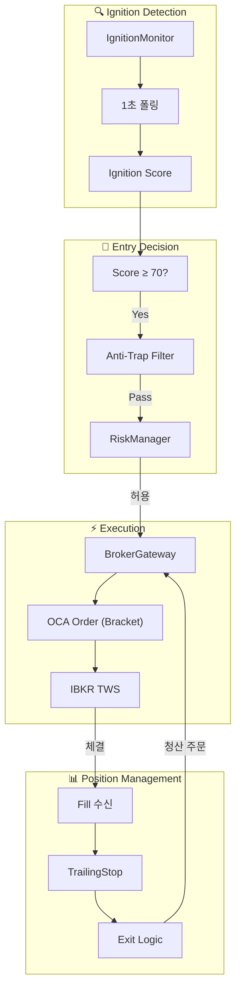
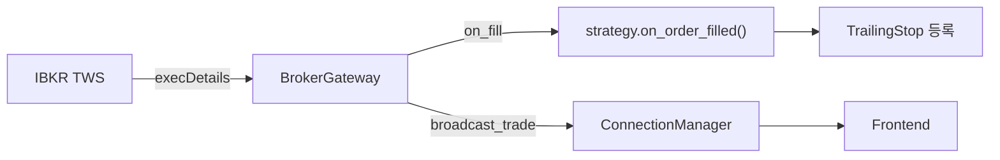

# Domain 5: Order Execution Flow

> Ignition 신호 → 브로커 주문 → 체결 → 청산

## 1. Module Participants

| Module | Location | Role |
|--------|----------|------|
| `IgnitionMonitor` | `backend/core/ignition_monitor.py` | 폭발 감지, Score 계산 |
| `SeismographStrategy` | `backend/strategies/seismograph/strategy.py` | Trigger Score 계산 |
| `BrokerGateway` | `backend/broker/gateway.py` | IBKR 주문 실행 |
| `RiskManager` | `backend/core/risk_manager.py` | 포지션 관리, 손절 |
| `TrailingStop` | `backend/core/trailing_stop.py` | 트레일링 스탑 관리 |

## 2. Dataflow Diagram



## 3. Order Types

| Type | Description | Trigger |
|------|-------------|---------|
| **OCA Entry** | One-Cancels-All Bracket | Ignition ≥ 70 |
| **Stop Loss** | -5% 손절 | 체결 즉시 설정 |
| **Trailing Stop** | ATR 기반 동적 손절 | 가격 상승 시 갱신 |
| **Take Profit** | 목표가 도달 | 가격 목표 도달 |

## 4. Risk Parameters

```python
RISK_CONFIG = {
    "max_position_size": "Kelly × 0.5",
    "max_concurrent": 3,
    "per_trade_stop": -0.05,  # -5%
    "daily_loss_limit": -0.03,  # -3%
    "weekly_loss_limit": -0.10,  # -10%
}
```

## 5. Ignition Score → Entry Flow

```python
# IgnitionMonitor._update_all_scores()
score = strategy.calculate_trigger_score(ticker)
if score >= 70:
    passed, reason = strategy.get_anti_trap_filter()
    if passed:
        await ws_manager.broadcast_ignition(
            ticker, score, passed_filter=True
        )
        # GUI에서 수동 확인 후 진입 또는 자동 진입
```

## 6. Fill Callback Chain


