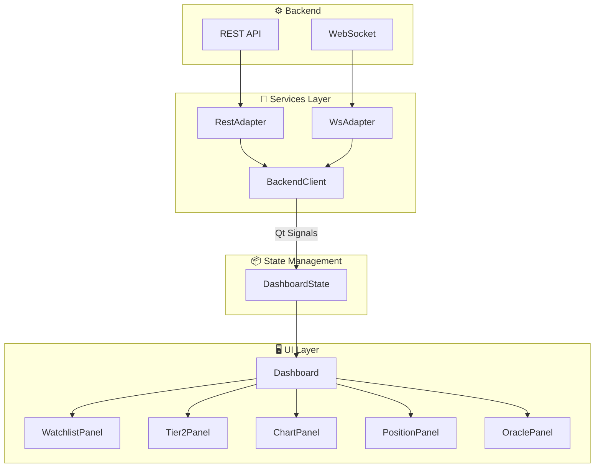
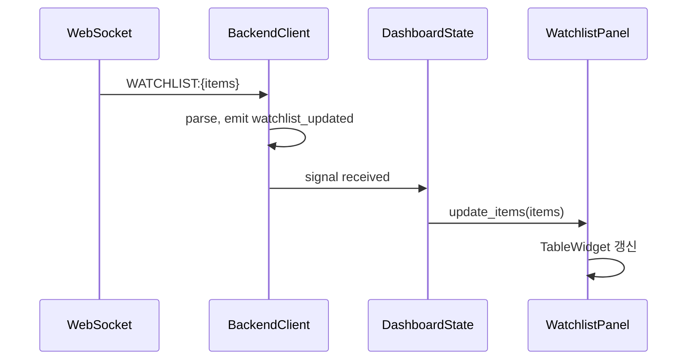
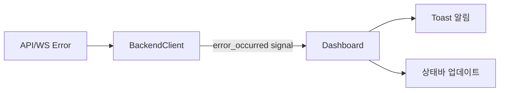

# Domain 6: Frontend State Flow

> Backend API → Dashboard → Panels 상태 전파 경로

## 1. Module Participants

| Module | Location | Role |
|--------|----------|------|
| `BackendClient` | `frontend/services/backend_client.py` | REST/WS 통합 클라이언트 |
| `RestAdapter` | `frontend/services/rest_adapter.py` | HTTP 요청 처리 |
| `WsAdapter` | `frontend/services/ws_adapter.py` | WebSocket 수신 처리 |
| `Dashboard` | `frontend/gui/dashboard.py` | 메인 윈도우 |
| `DashboardState` | `frontend/gui/state/dashboard_state.py` | 상태 관리 |
| `WatchlistPanel` | `frontend/gui/panels/watchlist_panel.py` | Tier1 패널 |
| `Tier2Panel` | `frontend/gui/panels/tier2_panel.py` | Hot Zone 패널 |
| `ChartPanel` | `frontend/gui/panels/chart_panel.py` | 차트 패널 |

## 2. Dataflow Diagram



## 3. Qt Signal Flow

| Signal | Source | Targets | Data |
|--------|--------|---------|------|
| `watchlist_updated` | BackendClient | WatchlistPanel | `List[WatchlistItem]` |
| `tick_received` | BackendClient | Tier2Panel, ChartPanel | ticker, price, vol |
| `ignition_updated` | BackendClient | Tier2Panel | ticker, score |
| `position_changed` | BackendClient | PositionPanel | position dict |
| `status_changed` | BackendClient | Dashboard | state enum |

## 4. Panel Update Cycle



## 5. REST API Usage

| Endpoint | Method | UI Component | Action |
|----------|--------|--------------|--------|
| `/api/watchlist` | GET | WatchlistPanel | 초기 로드 |
| `/api/chart/bars` | GET | ChartPanel | 히스토리 로드 |
| `/api/tier2/check-promotion` | POST | Tier2Panel | 승격 판단 |
| `/api/scanner/run` | POST | Dashboard | 스캔 시작 |
| `/api/control/start` | POST | Dashboard | 엔진 시작 |

## 6. State Synchronization

```python
# DashboardState
class DashboardState:
    watchlist: List[WatchlistItem]
    tier2_items: List[Tier2Item]
    current_ticker: Optional[str]
    engine_state: EngineState
    
    # Signals
    watchlist_changed = pyqtSignal(list)
    tier2_changed = pyqtSignal(list)
    ticker_selected = pyqtSignal(str)
```

## 7. Error Propagation


