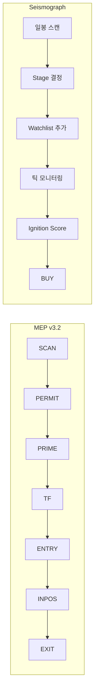

# MEP vs Seismograph 전략 심층 비교 분석

> **작성일**: 2026-01-09  
> **버전**: v1.0  
> **목적**: Tier2 승격 조건, 매매 시작 조건의 두 전략 간 차이 분석

---

## 1. 개요

| 항목 | MEP v3.2 | Seismograph |
|------|----------|-------------|
| **철학** | Tradeability (거래 가능성) 우선 | Accumulation (매집) 탐지 |
| **접근법** | 상태머신 + 실시간 미시구조 | 신호 강도 기반 점수화 |
| **데이터** | Bar Mode + Tick Mode (듀얼) | 일봉 기반 + 실시간 틱 |
| **세션 인식** | ✅ 7개 세션별 차별화 | ❌ 세션 구분 없음 |

---

## 2. Tier2 승격 조건 비교

### 2.1 MEP: SCAN → PRIME 전이

MEP에서 "Tier2"에 해당하는 개념은 **PRIME 상태**입니다.

```
상태 흐름: SCAN → PERMIT → PRIME → TF → ENTRY → INPOS → EXIT
                          ↑
                       Tier2에 해당
```

#### PRIME 진입 조건

```
𝒫(t) = TopK(R^session(t))
```

| 조건 | 수식 | 설명 |
|------|------|------|
| **Ready Score** | `R = rank(OFI) + rank(TickIntensity) + rank(VolumeAccel)` | 임박 강도 상위 K개 |
| **Macro Permission** | `MacroScore ∈ TopK` | 5분봉 기준 거시 허가 |
| **Activity Gate** | `TickCount_1m ≥ N_min(session)` | 세션별 최소 체결 건수 |
| **Liquidity Gate** | `Volume_10min ≥ V_min(session)` | 세션별 최소 거래량 |

#### 세션별 Activity Gate 임계값

| Session | N_min (체결 건수) | V_min (거래량) |
|---------|-------------------|----------------|
| PRE_EARLY | 5 | 5,000 |
| PRE_LATE | 15 | 10,000 |
| REG | 50 | 50,000 |
| POST_EARLY | 15 | 10,000 |
| POST_LATE | 5 | 3,000 |

---

### 2.2 Seismograph: Stage 기반 승격

Seismograph에서 "Tier2"에 해당하는 개념은 **Stage 4 (Tight Range)**입니다.

```python
# strategy.py Line 413-424
if tr > 0.5 and obv > 0.5:
    stage = "Stage 4 (Tight Range + OBV)"
    stage_number = 4
elif tr > 0.5:
    stage = "Stage 4 (Tight Range)"
    stage_number = 4
elif obv > 0.5:
    stage = "Stage 2 (OBV Divergence)"
    stage_number = 2
else:
    stage = "Stage 1 (Monitoring)"
    stage_number = 1
```

#### Stage 승격 조건

| Stage | 조건 | 의미 |
|-------|------|------|
| **1** | 기본 | 모니터링 대상 |
| **2** | `obv_divergence > 0.5` | OBV 다이버전스 감지 |
| **4** | `tight_range > 0.5` | 변동성 수축 확인 (= 폭발 임박) |

#### 핵심 차이점

| 비교 항목 | MEP | Seismograph |
|-----------|-----|-------------|
| **승격 기준** | 실시간 랭킹 (TopK) | 절대 임계값 (> 0.5) |
| **세션 적응** | ✅ 세션별 다른 임계값 | ❌ 고정 임계값 |
| **동적 조정** | 시장 상황에 따라 K 변동 | 고정된 stage_number |
| **데이터 기반** | 1분봉 + 틱 데이터 | 일봉 데이터 |

---

## 3. 매매 시작 조건 비교

### 3.1 MEP: ENTRY 조건 (Tick Mode)

MEP의 매매 시작은 **ENTRY 상태**에서 발생합니다.

```
조건: Touch_L(t) = 1 ∧ Hold_L(t) = 1 ∧ GatesOK ∧ FlowConfirm
```

#### ENTRY 집합

$$
\mathcal{E}(t) = \{s \in \mathcal{P}(t) \cap \mathcal{M}(t) : Touch_L(t) = 1,\ GatesOK\}
$$

#### Level System (세션별)

| Session | 레벨 후보 |
|---------|----------|
| PRE | PDC, PDH, PDL, ATR_Upper, ATR_Lower, Rolling_PMH |
| REG | PMH, PDH, PDL, VWAP, HOD, LOD |
| POST | HOD, LOD, VWAP, PDC, AH_High, AH_Low |

#### BUY 트리거 (Tick Mode)

```
Hold_L(t) = 1{P(τ) > L, ∀τ ∈ [t, t + HoldDuration]} = 1 → BUY
```

| Session | HoldDuration Factor |
|---------|---------------------|
| PRE_EARLY | 4.0x |
| REG | 1.0x |
| POST_LATE | 5.0x |

#### Hard Gates (진입 금지 조건)

| Gate | 수식 | 설명 |
|------|------|------|
| **비용 폭탄** | `Spread_quantile ≥ 0.95` | 스프레드 상위 5% |
| **Smart Overheat** | `O = rank(Range) - rank(Volume) - rank(OFI) ∈ TopY` | Flow 없는 급등 |
| **Activity Gate** | `TickCount_1m < N_min` | 최소 체결 미달 |
| **Liquidity Gate** | `Volume_10min < V_min` | 최소 거래량 미달 |

---

### 3.2 Seismograph: Ignition Trigger

Seismograph의 매매 시작은 **Ignition Score 임계값 초과**입니다.

```python
# strategy.py Line 341-349
if trigger_score >= threshold:  # threshold = 70 (기본값)
    return Signal(
        action="BUY",
        ticker=ticker,
        price=price,
        quantity=0,
        timestamp=timestamp,
        reason=f"Ignition Score {trigger_score:.1f} >= {threshold}",
    )
```

#### Ignition Score 계산

```python
# strategy.py Line 281-305
def calculate_trigger_score(self, ticker: str) -> float:
    ticks = list(self._tick_buffer[ticker])
    recent_volume = sum(t.volume for t in ticks[-10:])     # 최근 10틱
    older_volume = sum(t.volume for t in ticks[-60:-10])   # 이전 50틱
    volume_burst = recent_volume / (older_volume / 5)
    score = min(100.0, volume_burst * 20)
    return round(score, 1)
```

#### can_trade 조건

```python
# strategy.py Line 435
can_trade = stage_number >= 4 or score_v3 > 50
```

#### 핵심 차이점

| 비교 항목 | MEP | Seismograph |
|-----------|-----|-------------|
| **진입 트리거** | 레벨 돌파 + 유지 | 볼륨 버스트 감지 |
| **Gate 시스템** | 4개 Hard Gate (비용, 과열, 활동, 유동성) | 없음 (max_spread_pct만) |
| **세션 인식** | ✅ 세션별 레벨 세트 | ❌ |
| **포지션 사이징** | Tradeability × (1 - Spread) × (1 - Overheat) | 없음 (quantity = 0) |
| **레벨 기반** | ✅ PMH, VWAP, HOD 등 | ❌ |

---

## 4. 스코어링 시스템 비교

### 4.1 MEP 스코어 체계

```
Tradeability = Ready - Cost

Ready = rank(OFI) + rank(TickIntensity) + rank(VolumeAccel)
Cost = rank(Spread_self) + rank(Spread_xs) + rank(Range_self) + rank(Range_xs)
```

| 스코어 | 목적 | 구성 요소 |
|--------|------|----------|
| **Ready** | 임박 강도 | OFI, 틱 강도, 거래량 가속 |
| **Cost** | 거래 불리 | 스프레드 (자기/횡단), 변동폭 (자기/횡단) |
| **Tradeability** | 먹힘 가능성 | Ready - Cost |
| **FlowConfirm** | 흐름 확인 | OFI + 틱 강도 + 거래량 |

### 4.2 Seismograph 스코어 체계

```
Score V3 = clip(Base + Harmony Bonus, 0, 100) × Redundancy Penalty

Base = Σ(intensity × weight)
```

| 시그널 | 가중치 | 설명 |
|--------|--------|------|
| **tight_range** | 0.35 | 변동성 수축 |
| **obv_divergence** | 0.30 | OBV 흡수 |
| **accumulation_bar** | 0.20 | 매집봉 |
| **volume_dryout** | 0.15 | 거래량 마름 |

#### Harmony Bonus

```python
if tr > 0.6 and obv > 0.5:
    bonus += 10.0
if active_count >= 3:
    bonus += 5.0
```

#### Redundancy Penalty

```python
if tr > 0.7 and obv < 0.3 and ab < 0.3:
    return 0.5  # 50% 페널티
```

---

## 5. 핵심 차이 요약

### 5.1 철학적 차이

| 관점 | MEP | Seismograph |
|------|-----|-------------|
| **핵심 질문** | "지금 거래해도 되는가?" | "이 종목이 폭발할 것인가?" |
| **우선순위** | 비용 최소화 → 수익 추구 | 매집 탐지 → 진입 |
| **리스크 관리** | Hard Gate 4개 | 없음 |

### 5.2 구조적 차이



### 5.3 실전 적용 관점

| 시나리오 | MEP 행동 | Seismograph 행동 |
|----------|----------|-----------------|
| **스프레드 5% 이상** | ❌ 진입 금지 | ⚠️ 경고만 (max_spread_pct) |
| **프리마켓 04:00** | 예산 50%, TF 10m | 동일 로직 |
| **고거래량 + 저 OFI** | ❌ Smart Overheat | ✅ 진입 가능 |
| **다중 시그널 조합** | FlowConfirm 필수 | Harmony Bonus +15 |

---

## 6. 통합 가능성

### 6.1 현재 미구현 MEP 요소

Seismograph에서 MEP의 다음 요소가 미구현:

1. **세션 프로토콜** - 시간대별 파라미터 차별화
2. **Hard Gate 시스템** - 비용 폭탄, Smart Overheat
3. **레벨 기반 진입** - PMH, VWAP, HOD 등
4. **동적 예산 M(t)** - 시장 상황에 따른 진입 예산
5. **포지션 사이징** - Tradeability 기반 분배

### 6.2 권장 통합 방향

```
Phase 1: Session Protocol 도입
  - Seismograph 파라미터에 세션 승수 추가
  - 프리/에프터 마켓 차별화

Phase 2: Hard Gate 추가
  - Spread Gate (상위 5% 진입 금지)
  - Activity Gate (최소 체결 건수)

Phase 3: Level System
  - PMH, VWAP, HOD 레벨 추적
  - 레벨 터치/유지 조건 추가

Phase 4: 포지션 사이징
  - score_v3 기반 가중 분배
  - Spread/Overheat 페널티 적용
```

---

## 7. 결론

| 측면 | MEP | Seismograph | 권장 |
|------|-----|-------------|------|
| **비용 리스크 관리** | ✅ 우수 | ❌ 미흡 | MEP 도입 |
| **세션 적응성** | ✅ 우수 | ❌ 없음 | MEP 도입 |
| **매집 탐지** | ❌ 없음 | ✅ 우수 | Seismograph 유지 |
| **시그널 조합** | 암묵적 | ✅ 명시적 | Seismograph 유지 |
| **구현 복잡도** | 높음 | 낮음 | 점진적 통합 |

**최종 권장**: Seismograph의 매집 탐지 + MEP의 실행 정책을 단계적으로 통합
