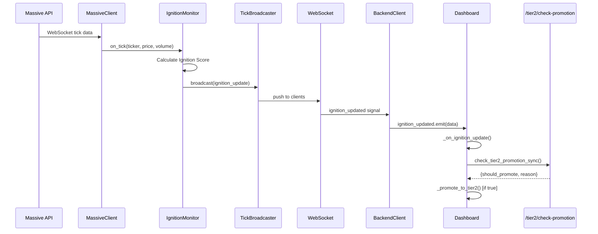
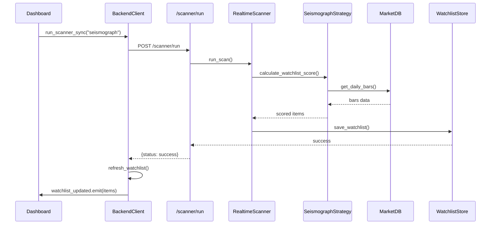
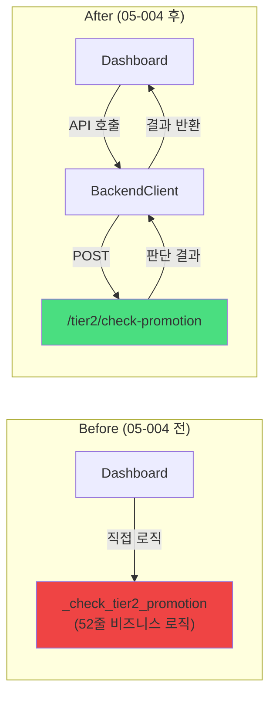

# Sigma9 Full System Data Flow

> **생성일**: 2026-01-08 16:18  
> **버전**: v2.0 (05-004 리팩터링 후)

---

## 1. 전체 시스템 아키텍처

```mermaid
flowchart TB
    subgraph External["☁️ External APIs"]
        MASSIVE["Massive API<br/>(Market Data)"]
        IBKR["IBKR TWS<br/>(Trading)"]
        OPENAI["OpenAI/Claude<br/>(LLM)"]
    end

    subgraph Backend["🔧 Backend (AWS EC2)"]
        direction TB
        
        subgraph API["🌐 API Layer"]
            SERVER["server.py<br/>FastAPI Entry"]
            ROUTES["routes/<br/>12 endpoints"]
            WS_API["websocket.py<br/>WS Feed"]
        end
        
        subgraph Core["⚙️ Core Engine"]
            SCANNER["RealtimeScanner"]
            IGNITION["IgnitionMonitor"]
            TICK_DISP["TickDispatcher"]
            TICK_BC["TickBroadcaster"]
            SUB_MGR["SubscriptionManager"]
        end
        
        subgraph Strategies["🎯 Strategies"]
            SEISMO["SeismographStrategy<br/>(signals/ + scoring/)"]
            STRAT_BASE["StrategyBase"]
        end
        
        subgraph Data["📦 Data Layer"]
            DB["MarketDB<br/>(SQLite WAL)"]
            MASSIVE_CLIENT["MassiveClient"]
            WL_STORE["WatchlistStore"]
        end
        
        subgraph Broker["💹 Broker"]
            IBKR_CONN["IBKRConnector"]
        end
        
        subgraph LLM["🤖 LLM"]
            ORACLE["Oracle<br/>(Read-Only)"]
        end
        
        DI["DI Container"]
    end

    subgraph Frontend["🖥️ Frontend (Windows)"]
        direction TB
        
        subgraph GUI["PyQt6 GUI"]
            DASH["Dashboard<br/>(Orchestrator)"]
            PANELS["Panels/<br/>watchlist, tier2, log"]
            CHART["PyQtGraphChart"]
        end
        
        subgraph Services["Services"]
            BC["BackendClient"]
            REST["RestAdapter"]
            WS_CLI["WsAdapter"]
            CHART_SVC["ChartDataService"]
        end
    end

    %% External connections
    MASSIVE --> MASSIVE_CLIENT
    IBKR --> IBKR_CONN
    OPENAI --> ORACLE

    %% API Layer
    SERVER --> ROUTES
    SERVER --> WS_API
    
    %% Core flow
    ROUTES --> SCANNER
    ROUTES --> IGNITION
    WS_API --> TICK_BC
    
    SCANNER --> SEISMO
    SCANNER --> WL_STORE
    SCANNER --> TICK_DISP
    SCANNER --> SUB_MGR
    
    IGNITION --> TICK_BC
    TICK_DISP --> SUB_MGR
    
    %% Data flow
    MASSIVE_CLIENT --> DB
    SCANNER --> MASSIVE_CLIENT
    SCANNER --> DB
    
    %% Strategy
    SEISMO --> STRAT_BASE
    
    %% DI
    DI -.-> SCANNER
    DI -.-> IGNITION
    DI -.-> WL_STORE
    
    %% Frontend connections
    BC --> REST
    BC --> WS_CLI
    REST --> ROUTES
    WS_CLI --> WS_API
    CHART_SVC --> DB
    
    DASH --> BC
    DASH --> PANELS
    DASH --> CHART
    CHART --> CHART_SVC

    %% Styling
    classDef external fill:#1e3a5f,stroke:#60a5fa
    classDef api fill:#c2410c,stroke:#fb923c
    classDef core fill:#1d4ed8,stroke:#60a5fa
    classDef data fill:#166534,stroke:#4ade80
    classDef strategy fill:#7c3aed,stroke:#a78bfa
    classDef frontend fill:#be185d,stroke:#f472b6
    
    class MASSIVE,IBKR,OPENAI external
    class SERVER,ROUTES,WS_API api
    class SCANNER,IGNITION,TICK_DISP,TICK_BC,SUB_MGR,DI core
    class DB,MASSIVE_CLIENT,WL_STORE data
    class SEISMO,STRAT_BASE strategy
    class DASH,PANELS,CHART,BC,REST,WS_CLI,CHART_SVC frontend
```

---

## 2. Real-time Data Flow (Ignition → Tier2)

---

## 3. Scanner → Watchlist Flow

---

## 4. 모듈 의존성 요약

| Layer | Module | Dependencies |
|-------|--------|--------------|
| **API** | routes/ | scanner, ignition, watchlist_store, backtest |
| **Core** | RealtimeScanner | SeismographStrategy, MassiveClient, DB, WatchlistStore |
| **Core** | IgnitionMonitor | TickBroadcaster |
| **Data** | MassiveClient | MarketDB |
| **Strategy** | SeismographStrategy | StrategyBase, TechnicalAnalysis |
| **Frontend** | Dashboard | BackendClient, Panels, Chart |
| **Frontend** | ChartDataService | MarketDB (Direct Access) |

---

## 5. 05-004 변경사항 반영

