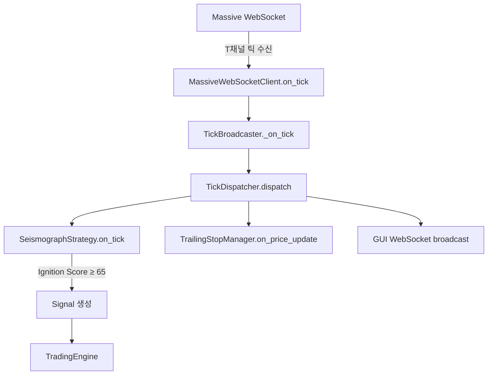

# 전략 모듈 Tick 데이터 수신 및 처리 문서

> **작성일**: 2026-01-02  
> **버전**: Phase 4.A.0.c  
> **참조**: `backend/core/tick_dispatcher.py`, `backend/strategies/seismograph.py`

---

## 📊 데이터 흐름 개요



---

## 1️⃣ Tick 데이터 수신 경로

### 1.1 Massive WebSocket → TickDispatcher

| 단계 | 컴포넌트 | 파일 | 역할 |
|------|----------|------|------|
| 1 | `MassiveWebSocketClient` | `data/massive_ws_client.py` | T채널 틱 수신 |
| 2 | `TickBroadcaster` | `core/tick_broadcaster.py` | 콜백 브릿지 |
| 3 | `TickDispatcher` | `core/tick_dispatcher.py` | 중앙 배포자 |

### 1.2 서버 시작 시 등록 (`server.py`)

```python
# TickDispatcher 생성
app_state.tick_dispatcher = TickDispatcher()

# 전략 등록
def strategy_tick_handler(tick: dict):
    active_strategy.on_tick(
        ticker=tick.get("ticker", ""),
        price=tick.get("price", 0),
        volume=tick.get("size", 0),
        timestamp=tick.get("time", 0)
    )
app_state.tick_dispatcher.register("strategy", strategy_tick_handler)
```

---

## 2️⃣ 전략 모듈 Tick 처리

### 2.1 `on_tick()` 메서드 시그니처

```python
def on_tick(
    self, 
    ticker: str,           # 종목 코드
    price: float,          # 체결 가격
    volume: int,           # 체결 수량
    timestamp: Any,        # 체결 시간
    side: str = "B",       # 체결 방향 (B=매수, S=매도)
    bid: float = 0.0,      # 매수호가
    ask: float = 0.0       # 매도호가
) -> Optional[Signal]:
```

### 2.2 처리 단계

```
┌─────────────────────────────────────────────────────────────┐
│ 1. 틱 버퍼 저장                                              │
│    - _tick_buffer[ticker] (deque, maxlen=1000)             │
│    - 60초 초과 틱 자동 제거                                   │
├─────────────────────────────────────────────────────────────┤
│ 2. Watchlist 체크                                           │
│    - ticker가 _watchlist에 없으면 → None 반환               │
├─────────────────────────────────────────────────────────────┤
│ 3. Trading Restrictions 체크                                │
│    - Stage 1-2 종목 → 모니터링만 (Signal 발생 X)            │
│    - Stage 3-4 종목 → 거래 가능                             │
├─────────────────────────────────────────────────────────────┤
│ 4. Ignition Score 계산                                      │
│    - 4가지 신호 가중합 (0~100점)                             │
│    - threshold (기본 65점) 미달 → None 반환                  │
├─────────────────────────────────────────────────────────────┤
│ 5. Anti-Trap Filter 검증                                    │
│    - 스프레드 < 1%                                          │
│    - 장 시작 후 15분 경과                                    │
│    - VWAP 위에 위치                                         │
├─────────────────────────────────────────────────────────────┤
│ 6. BUY Signal 생성                                          │
│    - SL/TP 레벨 계산                                        │
│    - indicators, metadata 포함                              │
└─────────────────────────────────────────────────────────────┘
```

---

## 3️⃣ Ignition Score 계산

### 3.1 4가지 신호 가중합

| 신호 | Weight | 조건 | 내부 메서드 |
|------|--------|------|-------------|
| **Tick Velocity** | 35% | 10초 틱 > 1분 평균 × 8 | `_calculate_tick_velocity()` |
| **Volume Burst** | 30% | 1분 거래량 > 5분 평균 × 6 | `_calculate_volume_burst()` |
| **Price Break** | 20% | 현재가 > 박스권 상단 + 0.5% | `_calculate_price_break()` |
| **Buy Pressure** | 15% | 매수/매도 비율 > 1.8 | `_calculate_buy_pressure()` |

### 3.2 데이터 소스

```python
# 틱 버퍼 (60초 유지)
self._tick_buffer[ticker]  # deque[TickData]

# 1분봉 버퍼
self._bar_1m[ticker]  # list[dict] - Massive AM채널

# 박스권 정보
self._box_range[ticker]  # (high, low)

# VWAP
self._vwap[ticker]  # float
```

---

## 4️⃣ Signal 생성

### 4.1 Signal 구조

```python
Signal(
    action="BUY",
    ticker=ticker,
    confidence=ignition_score / 100.0,  # 0.0 ~ 1.0
    reason=f"Ignition Score {score:.1f} >= {threshold}",
    metadata={
        "ignition_score": score,
        "price": price,
        "volume": volume,
        "timestamp": timestamp.isoformat(),
        "indicators": {
            "vwap": vwap,
            "atr": atr,
            "above_vwap": bool
        },
        "sl_tp": {
            "stop_loss": price * 0.97,
            "take_profit_1": price * 1.03,
            "take_profit_2": price * 1.06,
            "take_profit_3": price * 1.09
        }
    }
)
```

---

## 5️⃣ 미구현/향후 개선

| 항목 | 현재 상태 | 필요 작업 |
|------|----------|----------|
| `on_bar()` | stub (None 반환) | 1분봉 → Ignition 계산 연동 |
| ATR 계산 | 하드코딩 (3%) | 실제 일봉 데이터 기반 계산 |
| VWAP | last_close 사용 | 실시간 VWAP 계산 |
| 박스권 | 수동 설정 | 자동 박스권 탐지 |

---

## 📁 관련 파일

| 파일 | 역할 |
|------|------|
| `backend/server.py` | TickDispatcher에 전략 등록 |
| `backend/core/tick_dispatcher.py` | 틱 데이터 중앙 배포 |
| `backend/core/tick_broadcaster.py` | Massive → Dispatcher 브릿지 |
| `backend/strategies/seismograph.py` | 전략 on_tick() 구현 |
